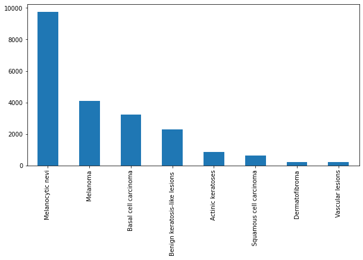
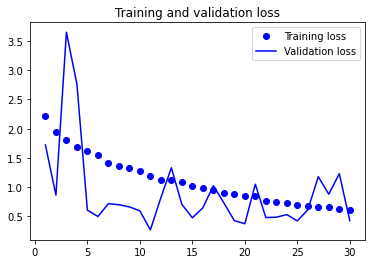
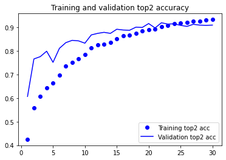
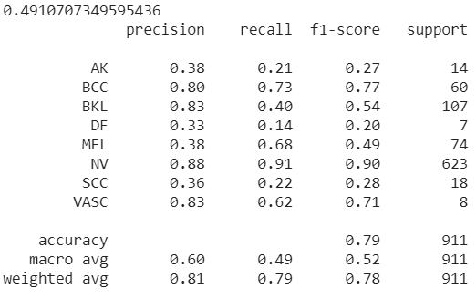
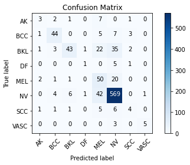

# deepHealthProjectISIC2019
Implementation  for ISIC 2019 challenge 

# ISIC-2019

This repository consists of the code I used to create my submission file for [ISIC-2019 Challenge](https://challenge2019.isic-archive.com/).
Brief summary of the method can be found in `method.pdf`.

## Data

In order to run the code first you need to download the [data](https://challenge2019.isic-archive.com/) and place the files inside /data. (you could copy my command for configure in the same mode)
The data folder should include 'ISIC_2019_Training_GroundTruth.csv', 'ISIC_2019_Training_Input' and 'ISIC_2019_Test_Input'.

Validation data size is 911 and pretrained model base model is xception-134-trial03.

### Data Distribution

##  Observations

### Accuracy and Loss

### Classification Report

### Confusion Matrix

## Contributors
<table>
  <tr>
    <td align="center"><a href="https://github.com/onboarding92"> <b>Luca Benzi</b></a> <a href="https://github.com/deepHealthProjectISIC2019/commits?author=BenziLuca" title="Code">💻</a> <a href="#ideas-BenziLuca" title="Ideas, Planning, & Feedback">🤔</a> <a href="#tool-BenziLuca" title="Tools">🔧</a></td>
  </tr>
</table>
